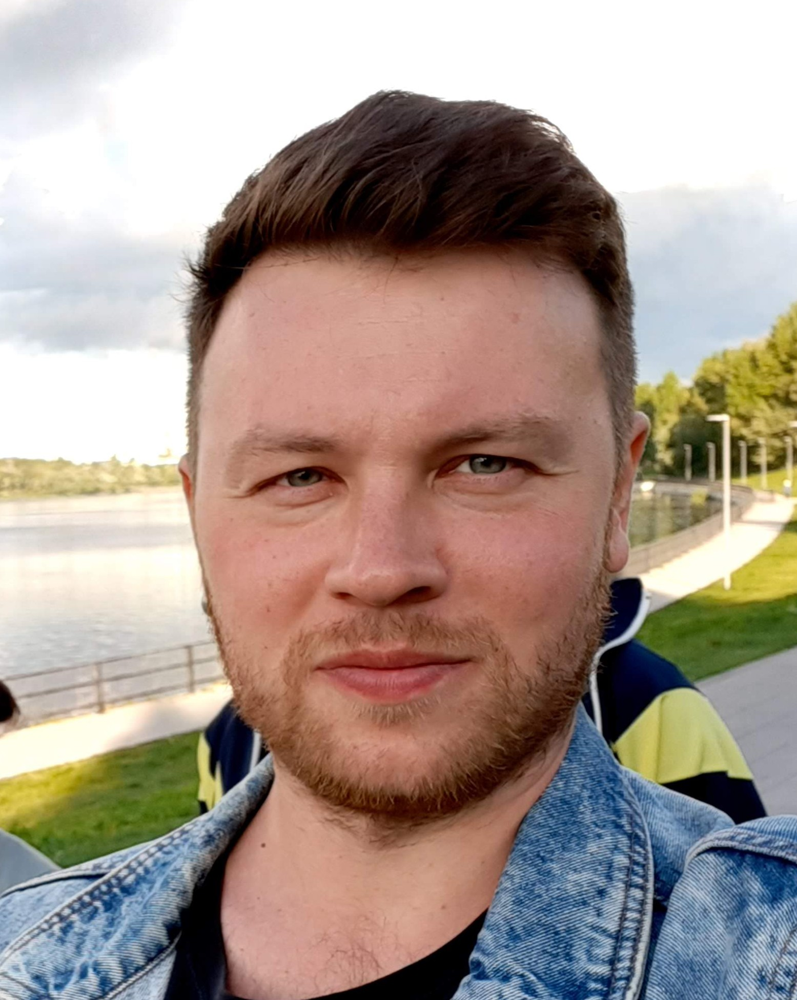

# Konstantin Avramenko

_Computer Vision Engineer (focused on R&D and True Innovations) based in Moscow, Russia_  

[Email](mailto:kuavramenko@gmail.com) / [LinkedIn](https://www.linkedin.com/in/konstantin-avramenko-24842472/) / [GitHub](https://github.com/CausticEngineer/) /
[Kaggle](https://www.kaggle.com/caustic)

___
## Skills
Experienced engineer with a 10 year background of working in FMCG industrie in varoius roles (Process Engineer, Packaging Engineer, 
Disruptive Innovations, Computer Vision).
Key technologies stack: Python, Pandas, Sklearn, Numpy, Scipy, Pytorch, Tensorflow, Bash, Git, Minitab, AutoCad, SolidWorks.  

___
## Experience

**R&D Disruptive Innovations, Innovations Manager, Computer Vision Engineer @ [MAY LLC](https://www.themay.com/en/)**  
_Moscow, Russia (May 2020 - Present)_  

_TO FILL IN_  

**R&D, Data Science Projects @ [MARS LLC](https://www.mars.com/)**  
_Moscow, Russia (September 2018 - May 2020)_  

_TO FILL IN_  

**R&D, Senior Packaging Development Technologist @ [MARS LLC](https://www.mars.com/)**  
_Moscow, Russia (September 2014 - May 2020)_  

_TO FILL IN_  

___
## Education
**Bauman Moscow State Technical University**  
_Moscow, Russia (September 2004 - June 2010)_  

- Master’s Degree in Mechanical Engineering
- Specialization in Multipurpose Wheeled and Tracked Machines
- Diploma project: modernization of multipurpose crawler tractor for providing mission demining
- GPA – 4,23/5,0

**Courses passed:**  
[Yandex and MIPT specialization](https://www.coursera.org/specializations/machine-learning-data-analysis),
[mlcourse.ai fall 2018 by ODS](https://mlcourse.ai/) (158 of 2323 rating),
[HSE introduction to Deep Learning](https://www.coursera.org/account/accomplishments/verify/WZ2G6PVVBSEP), 
[HSE basics of Python](https://www.coursera.org/account/accomplishments/verify/PEKGZ5WGAXLZ),
[Crash Course on Python](https://www.coursera.org/learn/python-crash-course/home/welcome).

___
## Additional
**Startup Co-Founder**  
_Moscow Russia, Bali Indonesia (2014 - 2015)_  
Developed surfers detection system, which is capable to detect and track surfers on waves by pan-tilt-zoom camera.  
Responsible for models training, development scripts for semi-auto labeling and development part of tracking system.  
[Example of field tests on Bali Island](https://www.youtube.com/watch?v=FGDQTwgcGQM)

___
## Other
- Multiple winner of the mathematical, physical competitions and conferences
- Two diplomas of music education (domra and trombone). In addition, play the guitar and piano
- Medalist in strength of materials in the Bauman University competition
- Captain of the University's and Mars`s football teams
- Have completed Coursera courses of Flying robotics development, Learning how to learn, projects on Arduino

